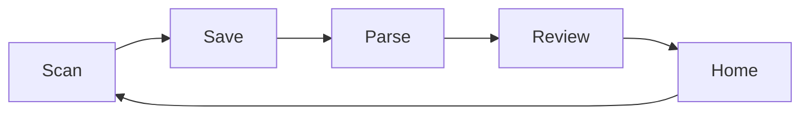

# Pockeet documentation

Single source of truth for product, UX, design, accessibility, and engineering. **Prefer updating these docs over duplicating context in issues or chat.**

## How to use this repo

| Role | Start here |
|------|------------|
| **Product / founder** | [vision](product/vision.md) → [mvp-scope](product/mvp-scope.md) → [roadmap](product/roadmap.md) |
| **Design** | [visual-identity](design/visual-identity.md) → [tokens](design/tokens.md) → [screens](ux/screens/README.md) |
| **Mobile engineering** | [mvp-scope](product/mvp-scope.md) → [architecture](engineering/architecture.md) → [decisions](engineering/decisions.md) → [app-structure](engineering/app-structure.md) |
| **AI assistants (Cursor)** | [cursor-rules](ai/cursor-rules.md) → [onboarding](ai/onboarding.md) |

## Doc map

```
docs/
├── README.md                 ← you are here
├── product/
│   ├── vision.md
│   ├── mvp-scope.md
│   └── roadmap.md
├── ux/
│   ├── principles.md
│   ├── navigation.md
│   └── screens/              ← per-screen specs
├── design/
│   ├── visual-identity.md
│   ├── tokens.md
│   ├── components.md
│   ├── layout.md
│   └── implementation-constraints.md
├── accessibility/
│   └── README.md
├── engineering/
│   ├── architecture.md
│   ├── data-model.md
│   ├── parse-pipeline.md
│   ├── stack.md
│   ├── decisions.md
│   └── app-structure.md
└── ai/
    ├── cursor-rules.md
    └── onboarding.md
```

## Principles for maintaining docs

1. **One home per topic** — link across files; don’t copy token tables into UX docs.
2. **MVP vs later** — mark deferred items in [roadmap](product/roadmap.md), not scattered TODOs.
3. **Implementation follows docs** — if code diverges, update docs in the same PR.
4. **Concise > complete** — specs should be scannable; details belong in the owning file.

## North-star loop



Everything in MVP should strengthen this loop. See [mvp-scope](product/mvp-scope.md).
