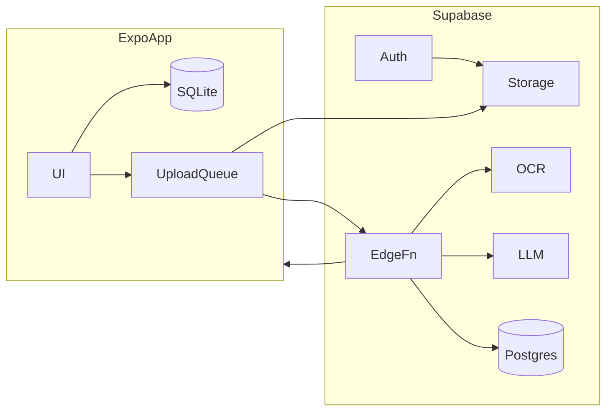

# Architecture overview

## Posture

**Local-first capture + cloud-assisted intelligence**

| Layer | Role |
|-------|------|
| Device | SQLite source of truth; instant UX; offline capture |
| Cloud | OCR + LLM parse; auth; image backup |
| MVP sync | Upload queue + poll — not full bidirectional sync |

## System diagram

## Client layers

| Layer | Responsibility |
|-------|----------------|
| `app/` (expo-router) | Routes only — thin |
| `features/*` | Flows: capture, review, home, receipts |
| `components/ui` | Primitives |
| `db/` | Drizzle schema, repos |
| `services/` | API, parse, sync |

**Rule:** features don’t import other features.

## State

| Concern | Tool |
|---------|------|
| Server/async | TanStack Query |
| Local persistence | SQLite + repositories |
| Ephemeral UI | Zustand (capture session) |
| Forms | React Hook Form + Zod |

## Analytics (MVP)

`recomputeMonthStats()` on device when receipts change — no server rollups yet.

## Security (summary)

TLS; encrypted blob storage; Supabase RLS; minimize PII in LLM prompts; Apple/Google auth; delete/export API stubs.

Details: [decisions](decisions.md). Parse: [parse-pipeline](parse-pipeline.md). Data: [data-model](data-model.md).

## Scale path

| Phase | Users | Change |
|-------|-------|--------|
| MVP | 0–5k | Edge fn + Postgres |
| Growth | 5k–100k | Job queue, workers |
| Scale | 100k+ | OCR cache by hash, rate limits |

Cost: client image resize ~2048px; parse dedupe by hash (later).
