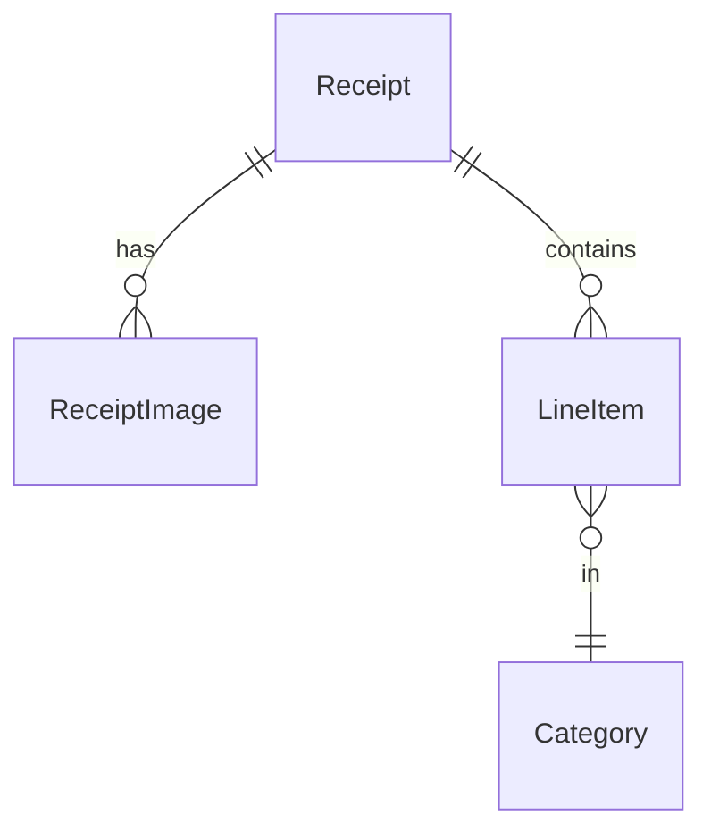

# Data model (MVP)

Money: **`amountMinor: number`** + **`currencyCode: string`** — never floats.

## Receipt

| Field | Notes |
|-------|--------|
| id, userId | UUID |
| status | `draft \| processing \| needs_review \| ready \| failed` |
| merchantName | string MVP |
| purchasedAt | ISO date |
| currencyCode | ILS, USD, … |
| totalMinor | int |
| subtotalMinor, taxMinor | optional; UI deferred |
| confidence | aggregate / flags |
| createdAt, updatedAt, deletedAt? | soft delete |

## ReceiptImage

| Field | Notes |
|-------|--------|
| receiptId, sortOrder | 1:N ordered pages |
| localUri | always first |
| remoteUrl?, uploadStatus | cloud backup |

## LineItem

| Field | Notes |
|-------|--------|
| receiptId, sortOrder | |
| name, quantity?, unitPriceMinor?, totalMinor | |
| categoryId | fixed taxonomy |
| confidence? | per field |

## Category (system)

`id`, `slug`, `name`, `icon`, `color` — seeded ~10–12; user custom later.

## ParseJob (server-primary)

`id`, `receiptId`, `status`, `errorCode?`, `attempts` — client infers from receipt.status for MVP UI.

## App preferences (MVP+)

| Key | Value | Notes |
|-----|-------|--------|
| `default_currency` | `ILS` \| `USD` \| `EUR` | Home rollups and Ask answers use this code |

Stored in `app_preferences` (`key`, `value`).

## Local analytics (computed)

Rebuilt on write — not source tables in MVP:
- monthly total by `YYYY-MM` (filtered by `default_currency`)
- category breakdown per month
- status counts per month
- delta vs previous month

Receipt list filters (MVP+): period, categories, status — query `receipts` + indexes on `purchased_at`, `status`, `default_category_id`.

Optional later: materialized SQLite tables if perf requires.

## Sync outbox (MVP)

`entity`, `op`, `payload`, `retryCount` — upload images + push receipt changes.

Conflict: last-write-wins per receipt; multi-device UI in v2.

## ER

Merchant table deferred — `merchantName` on receipt only.
