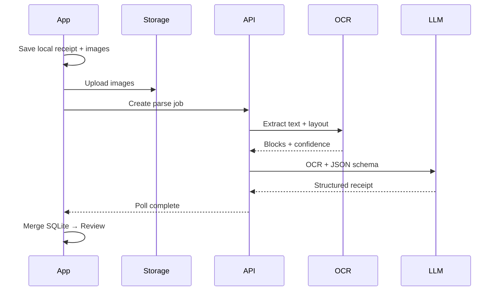

# Parse pipeline

Cloud OCR + LLM structuring. Abstract behind **`ParseProvider`** interface for vendor swaps.

## Sequence

## Stages

1. **Client resize** — max ~2048px edge.
2. **OCR** — Google Document AI or Textract (pick one for MVP).
3. **Structure** — LLM with strict JSON schema; **Zod** validate server-side.
4. **Post-process** — date parse, currency, category guess.
5. **Confidence** — per field → `needs_review` if below threshold.

## Long receipts

Concatenate OCR text in `sortOrder`; pass page boundaries to LLM; chunk + merge if token limit.

## Client delivery

- Poll every **2.5s** on processing screen.
- Manual **Retry** on failure.
- **Enter manually** → empty template in review.

## Validation

- Total reconciliation: line sum vs total → soft flag, not hard fail.
- Cap line item count server-side.
- Reject schema-invalid LLM output.

## Errors → UX

| Code | User reason snippet |
|------|---------------------|
| low_confidence_total | Low confidence on total |
| no_items | Couldn’t read items |
| parse_failed | Couldn’t read receipt |

Localized in app — [needs-review screen](../ux/screens/needs-review.md).

## Future

- Parse cache by image hash
- On-device OCR pre-pass
- Webhook instead of poll
