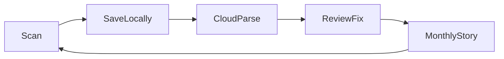

# MVP scope

Authoritative cut for v1. Optimize: **fast iteration, strong UX, foundations without overengineering**.

## North-star loop

**Rule:** If a feature doesn’t strengthen this loop, it waits ([roadmap](roadmap.md)).

## Lean MVP (one paragraph)

Sign in (Apple/Google) → scan multi-page receipt → saved locally instantly → cloud parses → user reviews/edits merchant, date, total, items, category → receipt `ready` → Home shows this month’s total, delta vs last month, one category chart, needs-review queue. **English-only UI (LTR)** for MVP; Hebrew + RTL deferred to v1.1+. **2 tabs + FAB.** No budgets, bank link, Insights tab, search, or paywall.

## Tier 1 — Must ship

| Area | Requirement |
|------|-------------|
| Capture | Camera + gallery; 2–5 pages; instant local save |
| Parse | Upload → OCR → LLM → structured receipt |
| Review | Edit fields; “Looks good” / “Fix later” |
| Home | Month total, delta, one chart, needs-review, recent 5 |
| Receipts | List + detail → edit via Review |
| i18n | English UI only (LTR); Hebrew + RTL in v1.1+ |
| Auth | Apple + Google (Supabase) |
| Data | `amountMinor` + `currencyCode`; receipt status enum |

**UX bar:** capture never blocks on network; Home from local DB; honest processing states; Review feels fast.

## Tier 2 — If ahead of schedule

Month picker (else still include — low effort), settings (language, currency), light haptics, onboarding 2 screens.

## MVP+ UI layer (post-core loop)

UI-first expansion **before** cloud parse and real LLM. Strengthens monthly story and receipt management with **local SQLite queries only**.

| Area | MVP+ |
|------|------|
| Home | Month picker, delta vs last month, status overview strip, tappable categories, Ask Pockeet card |
| Ask Pockeet | Modal chat UI; canned keyword answers from local data |
| Receipts | Filter sheet (month, range, categories, status), active chips, deep links from Home |
| Settings | Default display currency (`ILS` / `USD` / `EUR`) |
| Currency | Home totals sum matching currency only; footnote for mixed currencies |

**Still excluded:** Insights tab, FTS search, real LLM, FX conversion, export, budgets.

Specs: [ask-pockeet](../ux/screens/ask-pockeet.md), [receipt-filters](../ux/screens/receipt-filters.md).

## Tier 3 — Explicitly deferred

See [roadmap](roadmap.md#v11). Includes: Insights tab, FTS search, dark mode UI, budgets, bank link, export, paywall, widgets, custom categories, duplicate detection, on-device OCR, full sync engine.

## Navigation (MVP)

**2 tabs + FAB** — Home, Receipts. No Insights tab. Details: [navigation](../ux/navigation.md).

## Decide now vs keep simple

| Decide now | Keep simple (MVP) |
|------------|-------------------|
| Money as integer minor units | Poll parse status (no WebSocket) |
| Receipt status lifecycle | `recomputeMonthStats()` on device |
| SQLite local source of truth | `merchantName` string only |
| Multi-image per receipt | No search; month headers only |
| RTL + semantic design tokens | Apple + Google auth only |
| Supabase + ParseProvider abstraction | Last-write-wins; single-device |

Full table: [engineering/decisions.md](../engineering/decisions.md).

## Build order

| Week | Focus |
|------|--------|
| 1 | Expo scaffold, tokens, i18n/RTL, SQLite, shell Home |
| 2 | Capture + multi-image (local) |
| 3 | Auth + upload + parse Edge Function |
| 4 | Review + needs-review queue |
| 5 | Home analytics + Receipts list/detail |
| 6 | Polish, Hebrew QA, TestFlight |

Auth in week 3 OK only with `localUserId` → `userId` migration on first sign-in.

## Success metrics

- First receipt **reviewed** within 24h of install.
- ≥80% of receipts need ≤2 field edits after parse.
- Week-4 retention &gt;25% (baseline after beta).

## Related docs

- Screens: [ux/screens/README.md](../ux/screens/README.md)
- Stack: [engineering/stack.md](../engineering/stack.md)
- Tokens: [design/tokens.md](../design/tokens.md)
