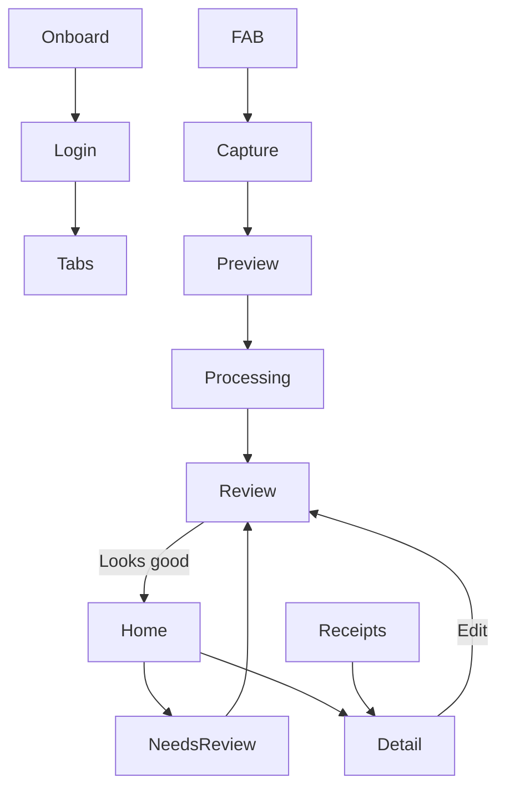

# Navigation & flows

## Shell

```
┌─────────────────────────────┐
│  Screen content             │
│                      [FAB]  │
├─────────────────────────────┤
│  Home    Receipts           │
└─────────────────────────────┘
```

- **Tabs:** Home `/(tabs)/`, Receipts `/(tabs)/receipts`
- **FAB:** scan — visible on tab roots only
- **Settings:** gear on Home → modal (not a tab)
- **Tabs hidden:** capture stack, auth, review (recommended)

## Flow diagram



## Routes

| Screen | Route |
|--------|-------|
| Home | `/(tabs)/index` |
| Receipts | `/(tabs)/receipts` (+ query filters) |
| Ask Pockeet | `ask` (modal from Home) |
| Capture | `capture/index` |
| Preview | `capture/preview` |
| Processing | `/receipt/[id]/processing` |
| Review | `/receipt/[id]/review` |
| Detail | `/receipt/[id]` |
| Needs review | inline on Home (dedicated route deferred) |
| Settings | modal from Home |
| Onboarding | `(auth)/onboarding` |
| Login | `(auth)/login` |

### Receipts query params (MVP+)

`/(tabs)/receipts?month=2026-05&status=needs_review&categories=cat_dining,cat_groceries&from=2026-01-01&to=2026-05-31`

Used when Home category bar or status strip navigates to filtered Receipts.

**One Review component** for post-scan, needs-review, and re-edit (`source`: scan | home | receipts | detail).

## FAB rules

| Context | Behavior |
|---------|----------|
| Tab roots | Visible; end side; 16pt above tab bar |
| Capture / processing / review | Hidden |
| Tap | Modal → `capture/` |
| Long-press | No-op in MVP |

RTL: FAB on physical **end** (right LTR, left RTL).

## Transitions

| Transition | Duration |
|------------|----------|
| Tab | 200ms crossfade |
| FAB → capture | 300ms slide up |
| Processing → review | crossfade ~300ms |
| Review → Home (confirm) | `replace` stack |

Motion limits: [design/visual-identity](../design/visual-identity.md#motion).

## Status copy

| Internal | EN | HE (example) |
|----------|-----|--------------|
| `processing` | Analyzing… | מנתח… |
| `needs_review` | Needs review | דורש בדיקה |
| `ready` | Ready | מוכן |
| `failed` | Couldn’t read receipt | לא הצלחנו לקרוא |

## Receipt lifecycle

`draft` → `processing` → `needs_review` | `ready` (+ `failed`)

After **Looks good:** `ready`. After **Fix later:** `needs_review` (edits saved).

## Screen index

| Screen | Spec |
|--------|------|
| Home | [screens/home.md](screens/home.md) |
| Capture | [screens/capture.md](screens/capture.md) |
| Processing | [screens/processing.md](screens/processing.md) |
| Review | [screens/review.md](screens/review.md) |
| Needs review | [screens/needs-review.md](screens/needs-review.md) |
| Receipts list | [screens/receipts-list.md](screens/receipts-list.md) |
| Receipt detail | [screens/receipt-detail.md](screens/receipt-detail.md) |
| Ask Pockeet | [screens/ask-pockeet.md](screens/ask-pockeet.md) |
| Receipt filters | [screens/receipt-filters.md](screens/receipt-filters.md) |
| Onboarding & auth | [screens/onboarding-auth.md](screens/onboarding-auth.md) |
| Settings | [screens/settings.md](screens/settings.md) |
